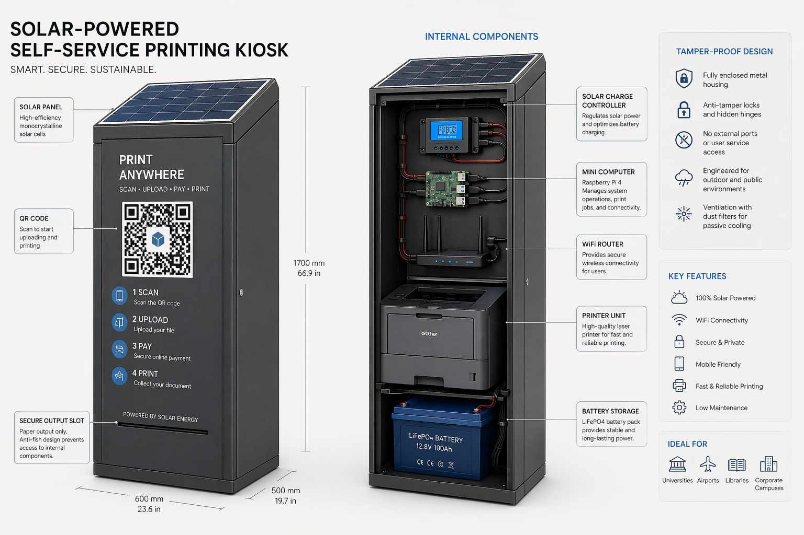
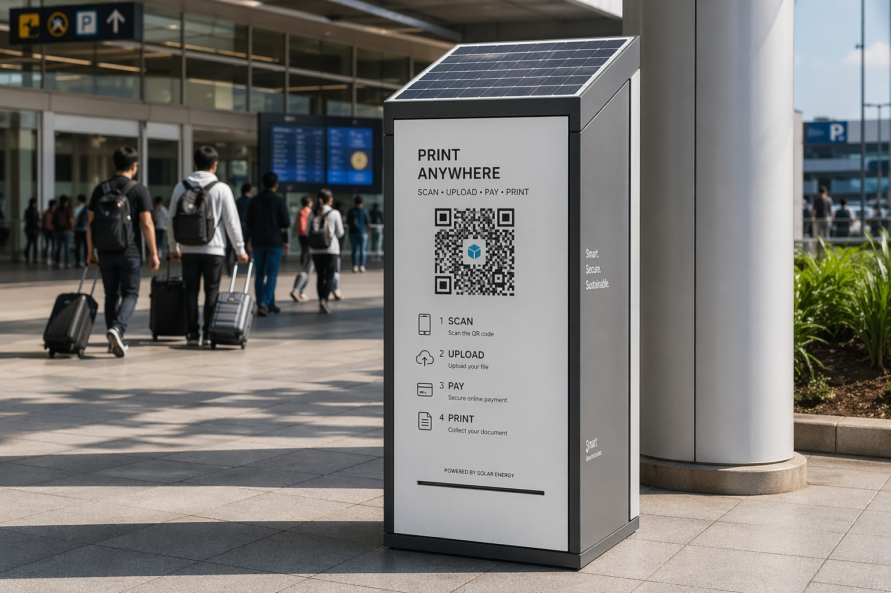
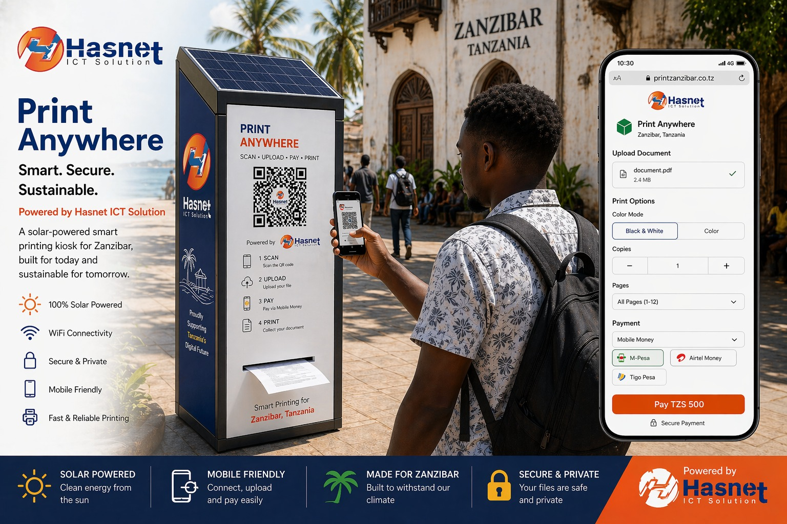
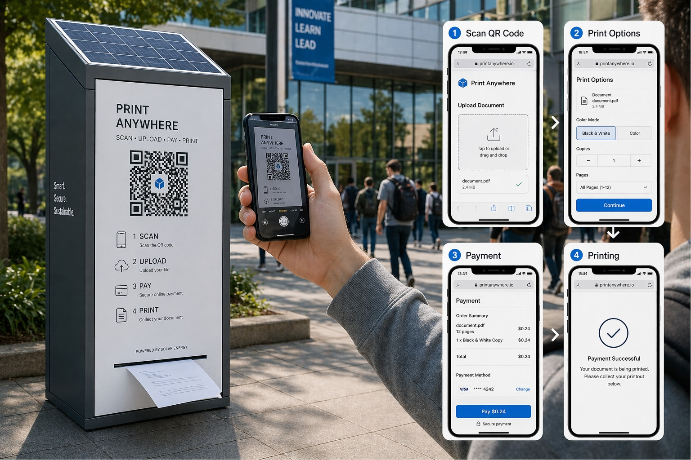

# Hasnet PrintHub Investor Pitch Pack
Date: April 25, 2026
Prepared by: Hasnet ICT Solution

## 1) One-Line Thesis
Hasnet PrintHub turns printing points into secure, low-operator, mobile-money-first kiosks where payment is enforced before print, enabling scalable multi-kiosk rollout across Zanzibar.

## 2) Problem We Solve
1. Manual print shops lose revenue through unpaid prints and weak reconciliation.
2. Operator dependency limits uptime and scale.
3. Multi-branch oversight is weak without centralized device/payment visibility.
4. Street/campus locations struggle with stable power and secure kiosk access.

## 3) Product Snapshot
Hasnet PrintHub is a full stack platform:
1. Customer app: scan QR, upload PDF, choose print options, pay, collect print.
2. Admin backend: pricing, devices, incidents, refunds, customer experience controls.
3. Edge agent on Raspberry Pi: local print dispatch, printer telemetry, heartbeat.
4. Payment policy gate: print is blocked until confirmed payment.

## 4) Visual Mockups (Current Concept Pack)
These are your current concept visuals from `mockup/`:

### 4.1 Kiosk Technical Concept

### 4.2 Real-World Placement Example

### 4.3 Zanzibar-Branded Experience Concept

### 4.4 Customer Journey (Scan -> Upload -> Pay -> Print)

## 5) How Transactions Flow
1. Customer scans kiosk QR.
2. Customer uploads document and selects print options.
3. System calculates quote server-side.
4. Customer pays via mobile money.
5. Backend verifies payment.
6. Edge agent receives only paid jobs and submits to CUPS.
7. Job status and receipt are exposed to customer/admin views.

## 6) Why This Is Investable
1. Clear control policy: no payment, no print.
2. Multi-kiosk architecture already in place (`DEVICE_CODE`-scoped heartbeats/jobs).
3. Local-first reliability for kiosk environments.
4. Operational tooling already built (provisioning scripts, runbooks, test suite).
5. Branded UX now aligned to Hasnet palette and support footer.

## 7) Current Build Status (As of 2026-04-25)
1. Admin auth foundation and protected routes implemented.
2. Multi-kiosk onboarding docs/template implemented.
3. Hotspot + QR workflow implemented and needs live-field validation on Pi.
4. Backend regression tests previously passing (`106 passed` from latest handoff run).
5. Branding refresh applied to admin and customer apps.

## 8) Near-Term Execution Plan (90 Days)
1. Finalize expanded RBAC (`super_admin`, `admin`, `technician`, `monitor`).
2. Complete real printer telemetry parity (identity, online/offline, actionable errors, consumables where supported).
3. Add incident email alerts for downtime and printer thresholds.
4. Validate QR + hotspot captive flow in live Zanzibar kiosk conditions.
5. Pilot in 1 to 3 live locations, then replicate via profile-based rollout.

## 9) Commercial Model (Investor View)
Primary revenue options:
1. Per-page margin share.
2. Monthly SaaS + support fee per kiosk.
3. Hybrid model (base fee + transaction percentage).

Optional upsides:
1. Institutional contracts (schools, airports, offices).
2. Kiosk sponsorship/branding inventory.
3. Managed operations subscriptions.

## 10) Funding Use (Template You Can Fill Before Meeting)
1. Hardware rollout: kiosk builds, printer stock, spares.
2. Operations: field installation, maintenance team, support.
3. Product: telemetry hardening, alerts, analytics, QA.
4. Compliance/legal: registration, IP protection, contracts.
5. Sales: pilot acquisition and institutional partnerships.

## 11) Suggested Ask Slide (Editable)
1. Amount sought: `TZS ______`.
2. Runway target: `___ months`.
3. Milestones tied to funds:
   - `__` live kiosks,
   - `__` monthly transactions,
   - uptime target `__%`,
   - payment-to-print success `__%`.

## 12) Investor Data Room Checklist
1. Product brief and architecture diagram.
2. Demo flow video/screenshots.
3. Latest milestone handoff and test evidence.
4. Pilot rollout plan and site criteria.
5. Unit economics sheet (`docs/C2B Charges.xlsx` + margin model).
6. Registration/compliance pack (see legal doc in this repo).
7. Team and operating SOPs (deployment, incident, payment reconciliation).

## 13) Strategic Positioning
Hasnet PrintHub is positioned as print infrastructure for Zanzibar: practical, auditable, low-touch operations with payment integrity and kiosk-scale repeatability.
